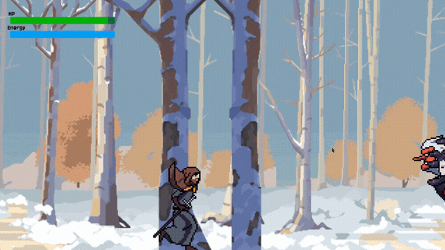

# 🧙‍♂️ Crazy Magic

**Crazy Magic** é um jogo de ação e aventura em estilo arcade desenvolvido em Python com a biblioteca Pygame. O foco principal é a agilidade: vença os desafios e derrote os chefes no menor tempo possível para garantir seu lugar no topo!

---

## 📖 História e Dinâmica

Um terrível mago rival sequestrou a companheira ou o companheiro do protagonista para utilizá-lo em um ritual de magia proibida. Agora, uma jornada perigosa começa para o resgate.

O jogo apresenta um sistema de **papeis invertidos** baseado na escolha do personagem no menu principal:
* Escolhendo **Felipe**: Você controla o mago em busca de resgatar sua companheira.
* Escolhendo **Yasmin**: Os papéis se invertem, e ela assume o controle para salvar o companheiro.

---

## 🕹️ Mecânicas do Jogo

* **Progressão por Fases:** O jogo possui 3 níveis lineares. Concluir um level desbloqueia o próximo automaticamente.
* **Inimigos e Chefes Únicos:** Cada fase conta com criaturas com padrões de ataque distintos e um *Boss* desafiador ao final.
* **Evolução do Personagem:** NPCs espalhados pelo mapa conversam com o protagonista, concedendo novos poderes e habilidades mágicas ao longo da jornada.
* **Sistema de Permadeath de Progresso:** Atenção! Mudar de personagem ou sair da seleção de fases após ter desbloqueado novos níveis fará com que você perca o progresso atual da sessão.

### ⏱️ Sistema de Ranking
Ao concluir o terceiro e último level, o jogo calcula o tempo total levado para finalizar a campanha. Você poderá registrar seu nome (de 5 caracteres). O menu de **Ranking** exibe o Top 10 de forma competitiva, priorizando os jogadores mais rápidos (ordem crescente de tempo).

---

## 🛠️ Arquitetura e Tecnologias

O projeto foi desenvolvido aplicando conceitos de Engenharia de Software e Orientação a Objetos:

* **Linguagem:** Python 3.10+
* **Framework Visual/Sons:** Pygame
* **Banco de Dados:** SQLite3 (Gerenciamento persistente do Ranking)
* **IDE de Desenvolvimento:** PyCharm

### 📐 Padrões de Projeto (Design Patterns) & Paradigmas
* **Programação Orientada a Objetos (POO):** Todo o ecossistema do jogo é modularizado utilizando classes, herança e encapsulamento.
* **Proxy Pattern:** Utilizado na persistência de dados para controlar o acesso e conexões seguras ao banco SQLite.
* **Factory Pattern:** Aplicado na criação dinâmica de inimigos, projéteis e elementos do cenário.
* **Mediator Pattern:** Responsável por gerenciar a comunicação e interações complexas entre os objetos do jogo (como colisões e diálogos de NPCs) sem acoplamento direto.

---

## 📜 Uso e Permissões

Este é um projeto de código aberto! Sinta-se à vontade para clonar, estudar a aplicação dos Design Patterns ou sugerir melhorias.

### Pré-requisitos
Ter o Python instalado em sua máquina.

---

## 🎨 Créditos e Atribuições

O desenvolvimento deste jogo utilizou os seguintes recursos gratuitos fornecidos por comunidades de artistas independentes:

    Sprites e Arte Visual: CraftPix.net (Licença Freebie).

    Efeitos Sonoros e Músicas: Pixabay (Uso livre para a comunidade).

    Tipografia: Fonte Jersey 10 via Google Fonts.

---

## 👨‍💻 Criador

Desenvolvido com dedicação por Felipe Barbosa Milhomes 🔗 GitHub: @DevFelipeMilhomes